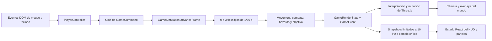
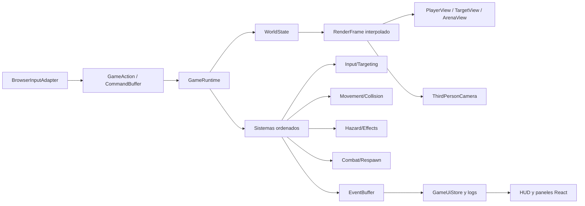

# Reporte de arquitectura: ATQ frente a Unity Third Person Starter Assets

**Fecha de revisión:** 4 de agosto de 2026  
**Proyecto revisado:** `arena-rpg-mvp`  
**Alcance:** arquitectura del renderer y de la simulación, flujo de entrada, ciclo por frame, movimiento, cámara, colisiones, combate, UI y pruebas.

## 1. Conclusión ejecutiva

El proyecto sí tiene semejanzas con la arquitectura de Unity y con el template **Starter Assets - ThirdPerson**, pero la semejanza es principalmente de **pipeline de ejecución**, no de estructura de componentes.

- **Similitud conceptual del ciclo de juego: media-alta.** Existe entrada, una cola de comandos, simulación, estado de render, interpolación, cámara posterior al movimiento y publicación de UI.
- **Similitud estructural con GameObject/Component/Prefab: baja-media.** React compone la escena, pero casi toda la conducta del mundo está centralizada en `GameSimulation` y en un componente `PlayerController` con muchas responsabilidades.
- **Paridad funcional con un controlador de tercera persona de Unity: baja.** No hay gravedad, salto, detección de suelo, pendientes, escalones, animador ni resolución de oclusión de cámara. El movimiento actual es esencialmente 2D sobre el plano XZ.
- **Separación entre simulación y render: mejor que la del Starter Asset típico.** El dominio no depende de React ni de Three.js, usa un tick fijo e interpolación y es fácil de probar en Node.

La valoración global es **5/10 de parecido arquitectónico**. No es un port de Unity ni intenta implementar su modelo de componentes, pero ya contiene equivalentes parciales de `Update`, `FixedUpdate`, `LateUpdate`, `PlayerInput`, `CharacterController` y Cinemachine.

La principal recomendación no es “convertirlo en Unity”, sino adoptar una arquitectura **orientada a runtime y sistemas**, conservando la simulación desacoplada que ya funciona. La prioridad inmediata es desmontar el acoplamiento del ciclo completo a `PlayerController.tsx`.

## 2. Estado y metodología de la revisión

Se revisó el árbol actual del workspace, incluyendo cambios locales no confirmados. No se modificaron esos archivos; este reporte es el único artefacto añadido por la auditoría.

Base técnica observada:

- Electron 43 como host de escritorio.
- React 19 para composición y UI.
- React Three Fiber 9 y Three.js r185 para escena y render 3D.
- TypeScript estricto.
- Vitest en entorno Node para la lógica de juego.
- 45 archivos TypeScript/TSX de producción y aproximadamente 7.172 líneas.
- 26 archivos de prueba y aproximadamente 1.865 líneas.

Verificaciones ejecutadas:

- `npm test`: **26 archivos y 122 pruebas correctas**.
- `npm run typecheck`: **correcto**.
- `npm run build:web`: **correcto**; Vite advirtió que el chunk principal minificado mide aproximadamente 1,22 MB (342 KB gzip).
- No se hizo verificación visual de la aplicación, de acuerdo con las instrucciones del proyecto.

Para la comparación se tomó como referencia el paquete oficial [Starter Assets - ThirdPerson | URP](https://assetstore.unity.com/packages/essentials/starter-assets-thirdperson-urp-196526), cuya versión publicada más reciente al momento de la revisión es la 1.1.7, además del ciclo de ejecución y el modelo GameObject/Component documentados por Unity.

## 3. Arquitectura actual

### 3.1 Capas reales

1. **Host de escritorio**
   - `electron/main/index.ts` crea una ventana segura y carga el renderer.
   - Electron no contiene lógica de juego; actúa como contenedor.

2. **Composición de aplicación y UI**
   - `src/main.tsx` monta React y el contexto del log.
   - `src/pages/Home/Home.tsx` conserva estado de paneles, cámara, calidad, perfil y snapshots del HUD.
   - La UI recibe datos mediante callbacks desde el canvas y mediante `GameLogContext`.

3. **Composición de escena 3D**
   - `src/components/GameCanvas/GameCanvas.tsx` crea `GameSimulation`, el registro de estados flotantes y la escena R3F.
   - `Arena`, `TestDummy`, `PlayerController`, `PerformanceLoadScenario` y `OverheadStatusLayer` forman el árbol visual.

4. **Runtime y puente por frame**
   - `src/components/GameCanvas/PlayerController.tsx` registra entrada DOM, hace raycasting, avanza la simulación, interpola, mueve el modelo, actualiza la cámara, consume eventos, publica HUD, dibuja debug y ajusta calidad.

5. **Simulación y dominio**
   - `src/game/GameSimulation.ts` coordina movimiento, vida, buffs, hazards, objetivo, autoataque, dummy, índice espacial, comandos y eventos.
   - Controladores menores como `MovementController`, `PlayerVitalityController`, `SpeedBoostController` y `TestDummyController` encapsulan estados concretos.
   - Funciones puras resuelven colisión, distancia, orientación, normalización y presentación de datos.

6. **Infraestructura local**
   - `localStorage` persiste cámara, calidad, nombre, consola y visibilidad de FPS.
   - `GameLogContext` adapta un store externo a React mediante `useSyncExternalStore`.

### 3.2 Flujo de un frame



Detalles importantes:

- El acumulador de `GameSimulation` usa ticks de 1/60 s, con máximo de tres pasos por frame y delta limitado.
- La posición anterior y actual permiten interpolar el jugador para render suave.
- Los comandos de puntero se coalescen para evitar hacer crecer la cola en cada movimiento.
- Los eventos de daño y vitalidad salen de la simulación hacia logs y overlays.
- El estado de UI se publica como máximo cada 100 ms salvo cambios críticos.
- Las entidades de carga y overlays usan buffers, registros y handles imperativos para evitar renders React por frame.

## 4. Correspondencia con Unity Third Person

| Concepto de Unity | Equivalente actual | Grado de parecido | Observación |
|---|---|---:|---|
| Scene y Prefab | Árbol JSX dentro de `GameCanvas` | Medio | La composición declarativa se parece a una jerarquía de escena, pero no hay assets de escena serializados ni variantes de prefab. |
| GameObject del jugador | `<group>` del jugador más estado dentro de `GameSimulation` | Medio-bajo | Identidad, conducta y representación están repartidas entre dos lugares. |
| Components/MonoBehaviours | Componentes React y controladores TypeScript | Medio-bajo | Los componentes visuales no son componentes de gameplay reutilizables y la simulación es centralizada. |
| `Update` | `useFrame` de React Three Fiber | Alto | Ambos ejecutan trabajo una vez por frame antes del render. |
| `FixedUpdate` | `GameSimulation.stepFixed()` mediante acumulador | Alto | Es una equivalencia explícita y además incorpora interpolación. |
| `LateUpdate` de cámara | Cámara actualizada después del movimiento dentro del mismo `useFrame` | Medio-alto | El orden es correcto, pero no existe una fase o sistema de cámara independiente. |
| `PlayerInput` + `StarterAssetsInputs` | Listeners DOM que crean `GameCommand` | Medio | Hay adaptación a comandos semánticos, pero la lectura física y los bindings están fragmentados. |
| `CharacterController` | `MovementController` + `ObstacleSpatialIndex` | Medio-bajo | Resuelve cápsula aproximada en XZ contra AABB, pero no suelo, gravedad, pendientes, escalones ni deslizamiento. |
| Cinemachine y target de cámara | Offset, `lerp`, `lookAt` y zoom manual | Medio-bajo | Tiene seguimiento amortiguado, pero no oclusión, colisión, composición ni rigs intercambiables. |
| Animator Controller | No existe | Nulo | La velocidad y orientación aún no alimentan una máquina de animación. |
| Inspector y ScriptableObjects | `constants.ts`, `player.ts` y estado de Settings | Bajo | La configuración está compilada en código y no tiene esquema de contenido versionado. |
| Eventos de colisión/trigger | Intersecciones consultadas cada tick | Medio | Los hazards modelan un trigger, pero el runtime central decide todo. |

### Respuesta directa

Sí se parece a Unity en esta secuencia:

```text
Input -> lógica de movimiento -> colisión -> estado del personaje
      -> presentación -> cámara -> UI
```

También reproduce de forma bastante clara la separación temporal `FixedUpdate -> Update/LateUpdate`. Sin embargo, no se parece al template en su unidad de composición: Unity arma un prefab de jugador con componentes adjuntos; ATQ arma un runtime central y usa React como adaptador visual.

Esta diferencia no es necesariamente negativa. `GameSimulation` puede ejecutarse y probarse sin navegador, renderer ni escena, una propiedad valiosa para replays, servidor autoritativo o simulación determinista. Conviene conservarla.

## 5. Fortalezas que deben preservarse

### 5.1 Simulación independiente del renderer

`src/game` no importa React ni Three.js. La lógica principal puede probarse con Vitest en Node. Este límite es el activo arquitectónico más importante del proyecto.

### 5.2 Tick fijo e interpolación

`GameSimulation.advanceFrame` desacopla la frecuencia visual de la simulación y limita la espiral de muerte. La posición anterior y actual evita usar estado React para movimiento de alta frecuencia.

### 5.3 Comandos y eventos tipados

`GameCommand` impide que la capa visual modifique directamente casi todas las conductas. `GameEvent` permite sacar daño, vitalidad y selección sin introducir dependencias de UI en el dominio.

### 5.4 Controladores pequeños y lógica pura

Movimiento, vida, boost, hazard, dummy, ventana de DPS, colisión y proyección se pueden probar de manera aislada. Las 122 pruebas correctas confirman una buena base de regresión.

### 5.5 Decisiones de rendimiento conscientes

El índice espacial, los `Float32Array`, el buffer circular del log, el registro de overlays, los handles imperativos y la compuerta de publicación de UI evitan asignaciones y renders innecesarios en rutas calientes.

### 5.6 Seguridad del host

La ventana de Electron usa `nodeIntegration: false`, `contextIsolation: true` y `sandbox: true`. La separación entre host y renderer es apropiada.

## 6. Hallazgos y riesgos

### P0. El ciclo del mundo depende del objeto visual del jugador

En `PlayerController.tsx`, el callback de `useFrame` retorna antes de llamar a `simulation.advanceFrame(delta)` si `groupRef.current` no existe. Por tanto, si el modelo del jugador no está montado, falla al cargar o se sustituye temporalmente, **se detiene toda la simulación**, incluidos dummy, hazards, cooldowns y carga de rendimiento.

El runtime debe pertenecer al canvas o a un `GameRuntime`, no al presentador del jugador.

### P0. `PlayerController.tsx` es un God Component

El archivo tiene 741 líneas, 15 propiedades y responsabilidades de:

- entrada de puntero y teclado;
- captura del puntero y cancelación por foco;
- raycasting de suelo y objetivo;
- scheduling de simulación;
- interpolación;
- orientación y presentación del jugador;
- cámara de tercera persona;
- actualización del dummy y entidades de carga;
- consumo de eventos y logs;
- publicación de UI;
- visualización de rutas de debug;
- benchmark y DPR adaptativo.

Esto dificulta pruebas, reutilización, multiplayer local, cambio de cámara y reemplazo del avatar.

### P0. `GameSimulation` está creciendo como God Object

`GameSimulation.ts` tiene 610 líneas y conoce directamente cada subsistema y entidad especial. `stepFixed()` contiene un orden manual de movimiento, distancia de selección, respawn, autoataque, hazard, efectos y carga de rendimiento.

El orden explícito es bueno, pero cada nueva mecánica obligará a editar el mismo archivo y a agregar condiciones específicas. El coordinador debe reducirse a ejecutar sistemas registrados sobre un `WorldState`.

### P1. Entrada fragmentada y parcialmente hardcoded

La entrada se reparte entre `PlayerController`, `Home` y `GameConsole`. Existe `SPEED_BOOST_KEYBINDING.code`, pero `PlayerController` compara directamente con `"KeyF"`. No hay una capa única de acciones, mapas de contexto, rebinding, gamepad ni política uniforme para overlays y foco.

### P1. Estado interno mutable expuesto

`getRenderState()` y varios `getState()` retornan objetos internos mutables. Los tipos marcan algunas propiedades como `readonly`, pero los objetos anidados siguen siendo modificables. Además, los vectores temporales de cámara y posición interpolada están definidos a nivel de módulo, por lo que dos instancias del canvas compartirían memoria temporal.

Esto es eficiente para una instancia, pero frágil para múltiples mundos, split screen, tests paralelos o herramientas de preview.

### P1. El puente de UI tiene dos modelos y datos duplicados

- El HUD se publica mediante callbacks que terminan en múltiples `useState` de `Home`.
- El log usa un store externo con `useSyncExternalStore`.
- `GameUiSnapshotMask` se transmite, pero `createUiSnapshot` construye siempre player, target y debug; el mask hoy es informativo.
- Existe un evento `critical-ui-change`, pero la decisión real depende también de una bandera interna y el consumidor no trata ese evento.

Un único `GameUiStore` con selectores simplificaría el flujo sin llevar estado por frame a React.

### P1. Hay duplicación y APIs residuales en el dominio

- El efecto `burning` se define en `hazards.ts` y vuelve a construirse dentro de `GameSimulation`.
- `writeActivePlayerEffects` y `getActivePlayerEffects` no participan en el flujo de producción actual.
- Hay límites de delta similares en `constants.ts` y `GameSimulation.ts`.
- `TestDummyStateView extends TestDummySnapshot` no crea un contrato distinto.

Son señales tempranas de que el límite entre definición, estado mutable, snapshot y presentación necesita aclararse.

### P1. No existe un equivalente sólido a Prefab/ScriptableObject

Arena, jugador, dummy, hazards, estadísticas y materiales se configuran mediante constantes y JSX. Esto funciona para un MVP, pero al añadir mapas, enemigos o variantes se multiplicarán imports y condicionales.

Hace falta una capa de contenido validado y versionado, separada del estado runtime.

### P2. El controlador físico solo cubre un mundo plano

El controlador actual detiene el movimiento completo ante una colisión candidata. No desliza contra muros y no contempla eje Y, gravedad, grounded, pendientes, escalones, plataformas móviles ni cámara bloqueada por geometría.

No es un defecto si el juego seguirá siendo un RPG de arena plano y click-to-move. Sí es una brecha si el objetivo real es alcanzar la experiencia del template Third Person de Unity.

### P2. No hay pipeline de animación

El template de Unity usa velocidad, grounded, salto y caída para alimentar parámetros del Animator. ATQ tiene velocidad y orientación, pero no existe una capa `AnimationState` ni un adaptador de clips/modelo.

### P2. Los módulos visuales especializados también concentran demasiado

`OverheadStatusSystem.tsx` tiene 917 líneas y combina registro, asignación de slots, buffers, señales de vida, shaders, geometría, atlas y componente R3F. La optimización data-oriented es válida, pero el archivo debería separar núcleo de datos, recursos GPU y vista.

`GameConsole.tsx` también supera 700 líneas y mezcla store view, virtualización, comandos, gestos y ventana persistente.

### P2. Faltan límites automáticos de arquitectura

No se observa configuración de lint, reglas de dependencias ni CI. TypeScript y Vitest cubren mucho, pero no impiden que `src/game` empiece a importar UI o que un componente vuelva a concentrar demasiadas capas.

El build web también concentra alrededor de 1,22 MB minificados en el chunk principal. En una aplicación 3D esto no es por sí solo un problema, pero conviene separar herramientas de desarrollo, paneles secundarios y escenarios de benchmark para que no formen parte del arranque de producción.

## 7. Arquitectura objetivo recomendada

La arquitectura apropiada es **runtime + sistemas + adaptadores**, no un ECS completo.



### 7.1 Runtime independiente

Crear un `GameRuntime` montado por `GameCanvas` que sea propietario de:

- reloj y acumulador;
- `WorldState`;
- cola de comandos;
- lista ordenada de sistemas;
- buffer de eventos;
- frame anterior/actual e interpolación;
- publicación de snapshots de UI.

El runtime debe avanzar aunque `PlayerView` no exista. Los presentadores solo leen `RenderFrame` y aplican transformaciones.

### 7.2 Sistemas explícitos

Dividir `stepFixed()` en sistemas pequeños con orden declarado:

1. `CommandSystem`
2. `TargetingSystem`
3. `MovementSystem`
4. `HazardSystem`
5. `EffectSystem`
6. `CombatSystem`
7. `RespawnSystem`
8. `PerformanceLoadSystem` solo en modo benchmark

No es necesario usar una librería ECS. Una interfaz interna como `step(context, world)` basta para eliminar condicionales del coordinador y permitir pruebas por sistema.

### 7.3 Presentadores separados

Reemplazar el actual `PlayerController` por piezas con una sola responsabilidad:

- `GameFrameRunner`: llama al runtime una vez por frame.
- `GameInputBridge`: traduce eventos del navegador a acciones.
- `PlayerView`: interpola y actualiza el objeto del jugador.
- `ThirdPersonCamera`: sigue al target después de actualizar la vista.
- `TargetViewBridge`: actualiza dummy y selección.
- `DebugPath`: dibuja destino y persecución.
- `UiSnapshotPublisher`: publica proyecciones de UI.
- `PerformanceTuner`: benchmark y DPR adaptativo.

El orden debe ser explícito en un único pipeline de frame o mediante prioridades documentadas, no depender del orden incidental de montaje de componentes.

### 7.4 Capa de acciones de entrada

Introducir acciones semánticas independientes del dispositivo:

```text
MoveTo(point)
SteerTo(point)
ActivateTarget(entityId)
ActivateAbility(abilityId)
AdjustCameraDistance(delta)
CancelGameplayInput
ToggleOverlay(overlayId)
```

El adaptador DOM decide cómo mouse, teclado o gamepad producen esas acciones. El runtime no debe conocer `PointerEvent`, `KeyboardEvent`, `KeyF`, canvas ni foco del navegador.

### 7.5 Contenido separado de estado runtime

Crear definiciones inmutables validadas para:

- `SceneDefinition`
- `PlayerDefinition`
- `EntityDefinition`
- `HazardDefinition`
- `AbilityDefinition`
- `CameraRigDefinition`

Es el equivalente web de prefabs y ScriptableObjects. Estas definiciones deben contener configuración; `WorldState` debe contener estado mutable de una partida.

### 7.6 Store de UI por selectores

Unificar HUD, objetivo, debug y eventos consumibles detrás de un store externo:

- React se suscribe solo a la proyección que necesita.
- El runtime publica a frecuencia limitada o ante cambios críticos.
- La posición por frame nunca pasa por React.
- El `mask` se implementa de verdad o se elimina.

### 7.7 Contratos de lectura seguros

- Usar vistas profundamente `readonly` o buffers de salida controlados.
- Evitar retornar estado interno mutable a adaptadores.
- Mover scratch vectors a instancias del presentador/runtime.
- Separar claramente `Definition`, `MutableState`, `RenderFrame` y `UiSnapshot`.

## 8. Estructura de carpetas propuesta

```text
src/
├── game/
│   ├── core/
│   │   ├── GameRuntime.ts
│   │   ├── GameClock.ts
│   │   ├── WorldState.ts
│   │   ├── GameCommand.ts
│   │   ├── GameEvent.ts
│   │   └── GameSnapshot.ts
│   ├── systems/
│   │   ├── MovementSystem.ts
│   │   ├── TargetingSystem.ts
│   │   ├── CombatSystem.ts
│   │   ├── HazardSystem.ts
│   │   ├── EffectSystem.ts
│   │   └── RespawnSystem.ts
│   ├── entities/
│   │   ├── player/
│   │   └── testDummy/
│   ├── input/
│   │   ├── GameAction.ts
│   │   ├── InputMap.ts
│   │   └── BrowserInputAdapter.ts
│   ├── content/
│   │   ├── SceneDefinition.ts
│   │   ├── PlayerDefinition.ts
│   │   └── defaultArena.ts
│   ├── physics/
│   └── ui/
│       └── GameUiStore.ts
├── components/
│   ├── GameCanvas/
│   ├── PlayerView/
│   ├── ThirdPersonCamera/
│   ├── TargetView/
│   ├── DebugPath/
│   └── OverheadStatus/
└── pages/
    └── Home/
```

La dirección permitida de dependencias debería ser:

```text
Electron / React / R3F adapters -> GameRuntime -> dominio y sistemas
infraestructura de navegador    -> puertos del runtime
dominio y sistemas              -X-> React, Three.js, DOM o Electron
```

## 9. Plan de implementación priorizado

| Orden | Mejora | Prioridad | Esfuerzo | Resultado esperado |
|---:|---|---:|---:|---|
| 1 | Mover `advanceFrame` a un runtime montado por `GameCanvas` | P0 | M | El mundo no depende del mesh del jugador. |
| 2 | Extraer input, cámara, vista, debug, UI y rendimiento de `PlayerController` | P0 | M | Responsabilidades comprobables y reemplazables. |
| 3 | Crear acciones semánticas y un único router de input | P0 | M | Rebinding, gamepad, overlays y foco coherentes. |
| 4 | Dividir `GameSimulation.stepFixed` en sistemas ordenados | P0 | L | Escalabilidad de mecánicas y entidades. |
| 5 | Endurecer contratos readonly y eliminar scratch global | P1 | S | Seguridad para múltiples instancias y tests. |
| 6 | Unificar UI en store externo con selectores | P1 | M | Menos prop drilling, duplicación y snapshots innecesarios. |
| 7 | Separar definiciones de contenido del estado runtime | P1 | M | Mapas, enemigos y variantes configurables. |
| 8 | Limpiar APIs residuales y duplicaciones | P1 | S | Dominio más claro antes de ampliar features. |
| 9 | Separar registro, GPU resources y vista de OverheadStatus | P1 | M | Mantener optimización sin un archivo monolítico. |
| 10 | Añadir lint, reglas de límites y CI | P1 | S | Evitar regresiones arquitectónicas. |
| 11 | Adoptar controlador cinemático 3D y colisión de cámara | P2 condicional | L | Paridad física con tercera persona. |
| 12 | Añadir estado y adaptador de animación | P2 condicional | L | Paridad visual con Animator. |

### Fase 1: refactor sin cambiar comportamiento

Implementar los puntos 1, 2, 3, 5 y 8. Mantener exactamente las reglas actuales de click, hold, boost, target, hazard y autoataque.

Pruebas de aceptación:

- La simulación avanza aunque `PlayerView` esté desmontado.
- La misma secuencia de comandos produce el mismo estado con distintas particiones de frame dentro de la política de backlog.
- No hay listeners DOM dentro de sistemas de dominio.
- Cámara, debug y calidad no importan ni controlan `GameSimulation`.
- `npm test`, typecheck y build siguen correctos.

### Fase 2: escalar el mundo

Implementar sistemas, contenido y store de UI. Migrar una mecánica por vez, manteniendo tests de caracterización del `GameSimulation` actual hasta completar la sustitución.

### Fase 3: solo si el producto necesita tercera persona completa

Incorporar controlador cinemático 3D, suelo, gravedad, salto, pendientes, escalones, colisión/oclusión de cámara y animación. No conviene pagar este coste si el diseño seguirá siendo una arena RPG plana controlada con mouse.

## 10. ¿Conviene usar ECS?

No por ahora.

El mundo actual tiene un jugador, un dummy, un hazard principal y pocos obstáculos. Un ECS completo añadiría migración, tooling y complejidad sin resolver el problema inmediato, que es la concentración de responsabilidades.

Sí conviene adoptar ideas data-oriented donde ya aportan valor:

- IDs estables de entidad;
- `WorldState` separado de definiciones;
- sistemas ordenados;
- arrays tipados en rutas masivas;
- snapshots y eventos explícitos;
- índices espaciales.

Si el juego llega a cientos o miles de entidades dinámicas con componentes combinables, entonces se puede evaluar ECS sobre una base ya preparada.

## 11. Decisión recomendada

La dirección correcta es:

> **Conservar el núcleo de simulación desacoplado, adoptar la composición modular de Unity y evitar copiar su acoplamiento a MonoBehaviour.**

En términos prácticos:

- Unity sirve como referencia para separar input, controlador, cámara, animación y configuración.
- El runtime TypeScript debe seguir siendo independiente de la escena.
- React Three Fiber debe ser un adaptador de presentación, no el dueño del mundo.
- El primer hito es eliminar `PlayerController` como coordinador global.

## 12. Fuentes de referencia

- [Unity Asset Store: Starter Assets - ThirdPerson | URP](https://assetstore.unity.com/packages/essentials/starter-assets-thirdperson-urp-196526)
- [Unity Manual: conceptos de GameObjects, Components y Scenes](https://docs.unity3d.com/Manual/key-concepts.html)
- [Unity Manual: orden de ejecución de eventos](https://docs.unity3d.com/Manual/execution-order.html)
- [Unity Scripting API: MonoBehaviour](https://docs.unity3d.com/ScriptReference/MonoBehaviour.html)
- [Unity Manual: Character Controller](https://docs.unity3d.com/Manual/class-CharacterController.html)
- [Unity Input System: PlayerInput](https://docs.unity3d.com/Packages/com.unity.inputsystem@1.4/api/UnityEngine.InputSystem.PlayerInput.html)
- [Unity Manual: Cinemachine](https://docs.unity3d.com/Manual/com.unity.cinemachine.html)
- [React Three Fiber: render loop y `useFrame`](https://github.com/pmndrs/react-three-fiber/blob/master/docs/tutorials/how-it-works.mdx)
